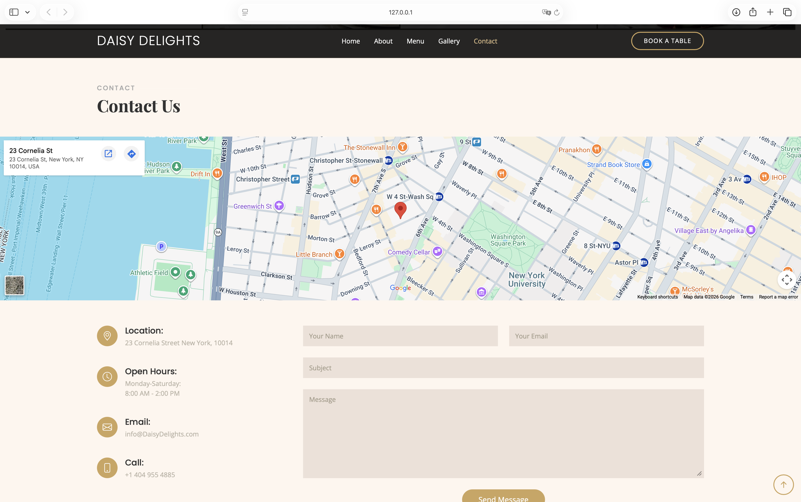
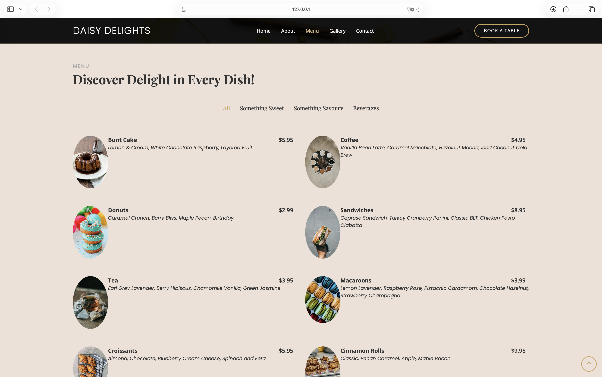

# Daisy Delights

A responsive bakery and café website built with HTML, CSS, JavaScript, and Bootstrap.

Daisy Delights was created as a front-end web development project to demonstrate responsive design, website customization, and user-focused interface development. The website showcases a fictional bakery and café through a clean, modern, and mobile-friendly user experience.

  
  
  
  
  

## Project Overview

Daisy Delights provides customers with an engaging online experience through intuitive navigation, attractive visuals, and clear organization of content. The project focuses on creating a professional restaurant-style website while following modern web development practices.

## Features

* Responsive design for desktop, tablet, and mobile devices
* Interactive navigation menu
* Hero section
* About section
* Menu showcase
* Gallery section
* Reservation form
* Contact information section
* Smooth scrolling navigation
* Mobile-friendly layout

## Technologies Used

* HTML5
* CSS3
* JavaScript
* Bootstrap 5
* Bootstrap Icons
* AOS (Animate On Scroll)
* GLightbox
* Swiper.js

## Skills Demonstrated

* Front-End Development
* Responsive Web Design
* User Interface Design
* Website Customization
* Bootstrap Framework Implementation
* Mobile-First Development
* Version Control with Git and GitHub

## Template Credit

This project is based on and customized from the Restaurantly template by BootstrapMade.

Template Name: Restaurantly

Template URL: https://bootstrapmade.com/restaurantly-restaurant-template/

Author: BootstrapMade

License: https://bootstrapmade.com/license/

## Author

### Zaanie Bowen

Software Engineer with a passion for front-end development, UI/UX design, and creating engaging digital experiences.

Portfolio: https://zaaniebowen.dev

LinkedIn: https://www.linkedin.com/in/melezaan-bowen-1bb690200/

GitHub: https://github.com/Zaanie10

## License

This repository is licensed under the MIT License.

Please note that portions of this project are derived from the Restaurantly template by BootstrapMade and remain subject to BootstrapMade's licensing terms.
